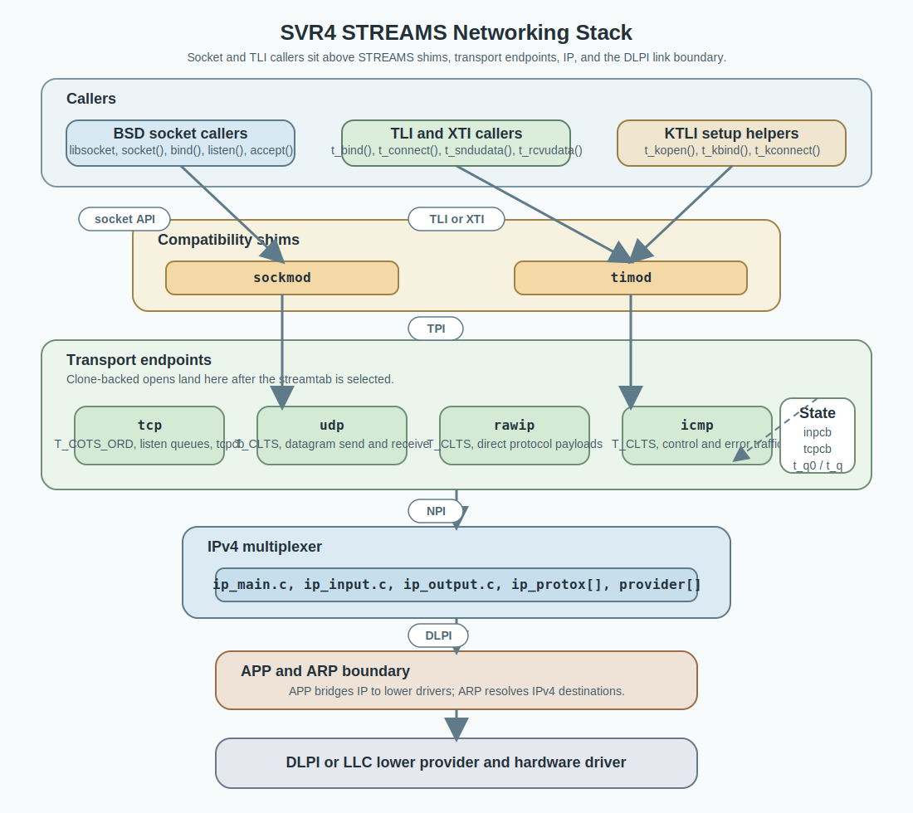
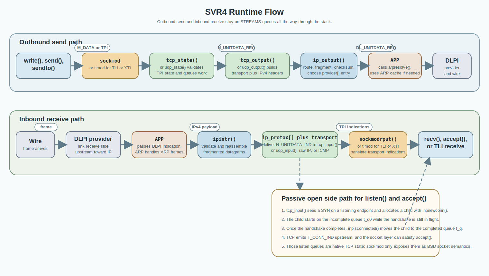

# Networking Diagrams

This page collects the visual summary of the STREAMS networking stack.

The diagrams are intentionally architectural rather than literal call graphs. Use them to orient yourself before dropping into the more detailed notes in [Architecture](architecture.md), [Socket And TLI Flow](socket-and-tli-flow.md), and [TCP/IP Data Path](tcpip-data-path.md).

## Layered Stack

This view shows the main layers, the compatibility shims, and the message families used at each boundary.

The main points to notice are:

- BSD socket behavior is implemented by `sockmod`, not by a native BSD socket kernel object model.
- TLI and XTI consumers use `timod` over the same transport endpoints; KTLI setup may push `timod`, but some kernel clients pop it for runtime traffic.
- The transport to IP boundary is NPI-based, while the IP to link boundary is DLPI-based.
- TCP, UDP, raw IP, and ICMP are separate clone-backed transport endpoints above the shared IP layer.

## Runtime Flow

This view shows the common outbound and inbound packet paths, plus the passive-open side path used for `listen()` and `accept()`.

Read this diagram left to right in each lane:

- The outbound lane starts at socket or TLI requests and ends at a frame emitted by the lower provider.
- The inbound lane starts at the received frame and ends at either `recv()`-style delivery or an `accept()` wakeup.
- The passive-open callout highlights where the TCP listen queues live: `t_q0` and `t_q` are native TCP state, not `sockmod` state.

## Scope Note

The page focuses on the IPv4 stack evidenced in this tree:

- user-space BSD socket callers historically select a transport through `libsocket` and `netconfig`
- transport endpoints allocate protocol state and bind protocol numbers into IP
- IP performs routing, fragmentation, reassembly, and inbound demultiplexing
- APP is the IP-to-link STREAMS module and uses ARP for address resolution

That is enough to reason about the full socket-to-wire and wire-to-socket flow without flattening the stack into a single pseudo-BSD layer.